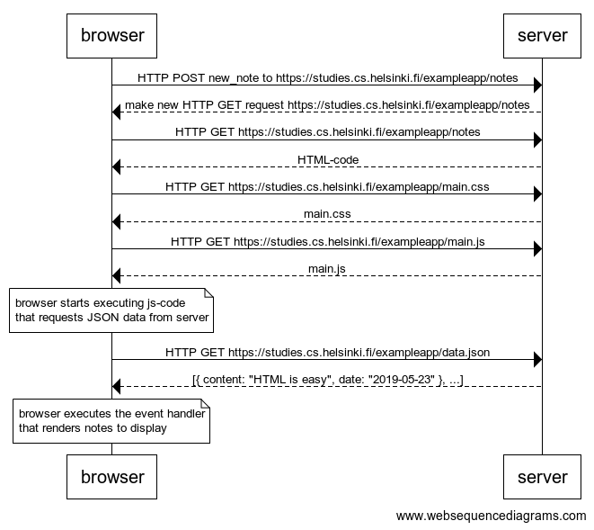

# 0.4: New note

## Task

In chapter [Loading a page containing JavaScript - review](https://fullstackopen.com/en/part0/fundamentals_of_web_apps#loading-a-page-containing-java-script-review) the chain of events caused by opening the page [https://studies.cs.helsinki.fi/exampleapp/notes](https://studies.cs.helsinki.fi/exampleapp/notes) is depicted as a sequence diagram

The diagram was made using websequencediagrams service as follows: 

```
browser->server: HTTP GET https://studies.cs.helsinki.fi/exampleapp/notes
server-->browser: HTML-code
browser->server: HTTP GET https://studies.cs.helsinki.fi/exampleapp/main.css
server-->browser: main.css
browser->server: HTTP GET https://studies.cs.helsinki.fi/exampleapp/main.js
server-->browser: main.js

note over browser:
browser starts executing js-code
that requests JSON data from server 
end note

browser->server: HTTP GET https://studies.cs.helsinki.fi/exampleapp/data.json
server-->browser: [{ content: "HTML is easy", date: "2019-05-23" }, ...]

note over browser:
browser executes the event handler
that renders notes to display
end note
```

Create a similar diagram depicting the situation where the user creates a new note on page [https://studies.cs.helsinki.fi/exampleapp/notes](https://studies.cs.helsinki.fi/exampleapp/notes) when writing something into the text field and clicking the submit button.

If necessary, show operations on the browser or on the server as comments on the diagram.

The diagram does not have to be a sequence diagram. Any sensible way of presenting the events is fine.

All necessary information for doing this, and the next two exercises, can be found from the text of [this part](https://fullstackopen.com/en/part0/fundamentals_of_web_apps#forms-and-http-post). The idea of these exercises is to read the text through once more, and to think through what is going on there. Reading the application [code](https://github.com/mluukkai/example_app) is not necessary, but it is of course possible.

Note perhaps the best way to do diagrams is the [Mermaid](https://github.com/mermaid-js/mermaid#sequence-diagram-docs---live-editor) syntax that is now implemented in [GitHub](https://github.blog/2022-02-14-include-diagrams-markdown-files-mermaid/) markdown pages! 

## Solution

```
browser->server: HTTP POST new_note to https://studies.cs.helsinki.fi/exampleapp/notes
server-->browser: make new HTTP GET request https://studies.cs.helsinki.fi/exampleapp/notes

browser->server: HTTP GET https://studies.cs.helsinki.fi/exampleapp/notes
server-->browser: HTML-code
browser->server: HTTP GET https://studies.cs.helsinki.fi/exampleapp/main.css
server-->browser: main.css
browser->server: HTTP GET https://studies.cs.helsinki.fi/exampleapp/main.js
server-->browser: main.js

note over browser:
browser starts executing js-code
that requests JSON data from server 
end note

browser->server: HTTP GET https://studies.cs.helsinki.fi/exampleapp/data.json
server-->browser: [{ content: "hee", date: "2022-11-23T22:24:42.858Z" }, ...]

note over browser:
browser executes the event handler
that renders notes to display
end note
```



[back to README](../README.md)

