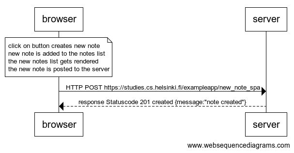

# 0.6: New note

## Task

Create a diagram depicting the situation where the user creates a new note using the single page version of the app.

This was the last exercise, and it's time to push your answers to GitHub and mark the exercises as done in the [submission system](https://studies.cs.helsinki.fi/stats/courses/fullstackopen).

## Solution

```
note over browser:
click on button creates new note
new note is added to the notes list
the new notes list gets rendered
the new note is posted to the server
end note

browser->server: HTTP POST https://studies.cs.helsinki.fi/exampleapp/new_note_spa
server-->browser: response Statuscode 201 created {message:"note created"}
```



[back to README](../README.md)