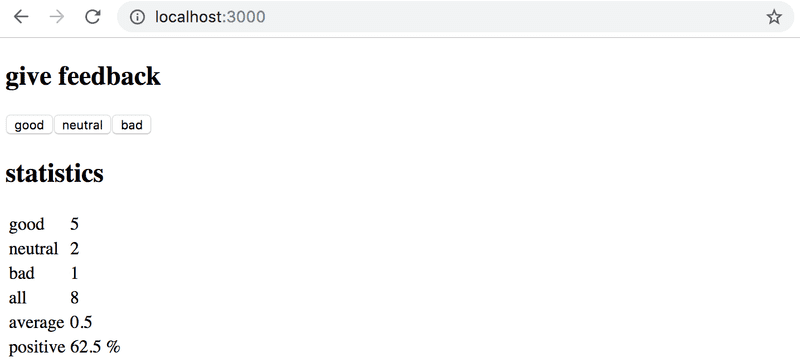

# 1.11: unicafe step6

## Task

Display the statistics in an HTML table, so that your application looks roughly like this:



## Solution

App.js:

```javascript
import { useState } from "react";

const Button = ({ text, handleOnClick }) => {
  return <button onClick={handleOnClick}>{text}</button>;
};

const Feedback = (props) => {
  const { good, setGood, neutral, setNeutral, bad, setBad } = props;

  const handleGoodClick = () => {
    setGood(good + 1);
  };

  const handleNeutralClick = () => {
    setNeutral(neutral + 1);
  };

  const handleBadClick = () => {
    setBad(bad + 1);
  };

  return (
    <div>
      <h1>give feedback</h1>
      <Button text="good" handleOnClick={handleGoodClick} />
      <Button text="neutral" handleOnClick={handleNeutralClick} />
      <Button text="bad" handleOnClick={handleBadClick} />
    </div>
  );
};

const StatisticLine = ({ text, value }) => {
  return (
    <tr>
      <td>{text}</td>
      <td>{value}</td>
    </tr>
  );
};

const Statistics = ({ good, neutral, bad }) => {
  const all = good + neutral + bad;
  const average = Math.round((((good + neutral + bad) / 3)  + Number.EPSILON) * 100) / 100;
  const positive = all !== 0 ? (Math.round((((good / all) * 100) + Number.EPSILON) * 100) / 100) : 0;
  
  if (all === 0) {
    return (
      <div>
        <h1>statistics</h1>
        <p>no feedback given</p>
      </div>
    );
  }
  return (
    <div>
      <h1>statistics</h1>
      <table>
        <tbody>
          <StatisticLine text="good" value={good} />
          <StatisticLine text="neutral" value={neutral} />
          <StatisticLine text="bad" value={bad} />
          <StatisticLine text="all" value={all} />
          <StatisticLine text="average" value={average} />
          <StatisticLine text="positive" value={positive} />
        </tbody>
      </table>
    </div>
  );
};

const App = () => {
  // save clicks of each button to its own state
  const [good, setGood] = useState(0);
  const [neutral, setNeutral] = useState(0);
  const [bad, setBad] = useState(0);

  return (
    <div>
      <Feedback
        good={good}
        setGood={setGood}
        neutral={neutral}
        setNeutral={setNeutral}
        bad={bad}
        setBad={setBad}
      />
      <Statistics good={good} neutral={neutral} bad={bad} />
    </div>
  );
};

export default App;
```