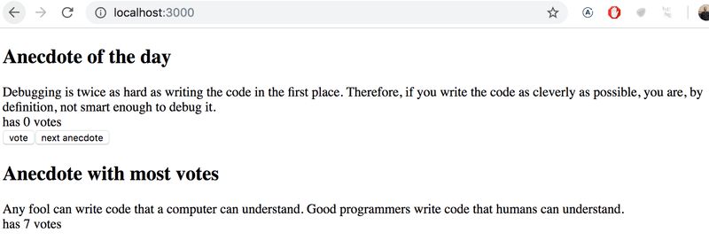

# 1.14: anecdotes step3

## Task

Now implement the final version of the application that displays the anecdote with the largest number of votes:



## Solution

App.js:

```javascript
import { useState } from 'react'

const App = () => {
  const anecdotes = [
    'If it hurts, do it more often.',
    'Adding manpower to a late software project makes it later!',
    'The first 90 percent of the code accounts for the first 10 percent of the development time...The remaining 10 percent of the code accounts for the other 90 percent of the development time.',
    'Any fool can write code that a computer can understand. Good programmers write code that humans can understand.',
    'Premature optimization is the root of all evil.',
    'Debugging is twice as hard as writing the code in the first place. Therefore, if you write the code as cleverly as possible, you are, by definition, not smart enough to debug it.',
    'Programming without an extremely heavy use of console.log is same as if a doctor would refuse to use x-rays or blood tests when diagnosing patients.'
  ]
   
  const [selected, setSelected] = useState(0)
  const [votes, setVotes] = useState(Array(7).fill(0))

  const mostVotes = Math.max(...votes)
  const mostVotedAnecdote = votes.indexOf(mostVotes)

  const getRandom = () => {
    return Math.floor(Math.random() * 7)
  }

  const handleVoteClick = () => {
    const copy = [...votes]
    copy[selected] += 1
    setVotes(copy)
  }

  return (
    <div>
      <h1>Anecdote of the day</h1>
      <p>{anecdotes[selected]}</p>
      <p>has {votes[selected]} votes</p>
      <button onClick={() => handleVoteClick()}>vote</button>
      <button onClick={() => setSelected(getRandom())}>next anecdote</button>
      <h1>Anecdote with most votes</h1>
      <p>{anecdotes[mostVotedAnecdote]}</p>
      <p>has {mostVotes} votes</p>
    </div>
  )
}

export default App
```