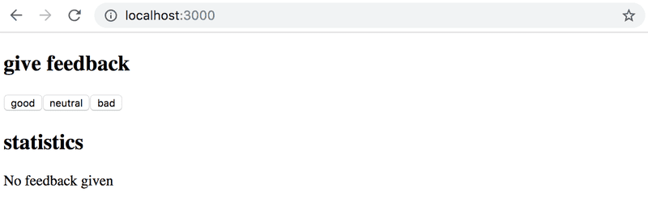

# 1.6: unicafe step1

## Task

Change your application to display statistics only once feedback has been gathered.



## Solution

app.js:

```javascript
import { useState } from 'react'

const Statistics = (props) => {
  const { good, neutral, bad, all, average, positive} = props

  if (all === 0) {
    return (
      <div>
        <h1>statistics</h1>
        <p>No feedback given</p>
      </div>
    )
  }
  return (
    <div>
      <h1>statistics</h1>
      <p>good {good}</p>
      <p>neutral {neutral}</p>
      <p>bad {bad}</p>
      <p>all {all}</p>
      <p>average {average}</p>
      <p>positive {positive} %</p>
    </div>
  )
}

const App = () => {
  // save clicks of each button to its own state
  const [good, setGood] = useState(0)
  const [neutral, setNeutral] = useState(0)
  const [bad, setBad] = useState(0)

  const all = good + neutral + bad
  const average = (good - bad) / all
  const positive = good / all * 100

  const goodClick = () => {
    setGood(good + 1)
  }

  const neutralClick = () => {
    setNeutral(neutral + 1)
  }

  const badClick = () => {
    setBad(bad + 1)
  }

  return (
    <div>
      <h1>give feedback</h1>
      <button onClick={goodClick}>good</button>
      <button onClick={neutralClick}>neutral</button>
      <button onClick={badClick}>bad</button>
      <Statistics good={good} neutral={neutral} bad={bad} all={all} average={average} positive={positive} />
    </div>
  )
}

export default App
```