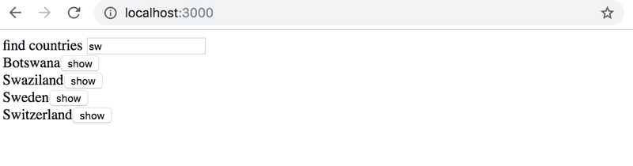

# 2.13 data for countries step2

## Task

Improve on the application in the previous exercise, such that when the names of multiple countries are shown on the page there is a button next to the name of the country, which when pressed shows the view for that country:



In this exercise it is also enough that your application works for most of the countries. Countries whose name appears in the name of another country, like Sudan, can be ignored.

## Solution

App.js:

```javascript
import { useState, useEffect } from 'react'

import axios from "axios"

import Search from "./components/Search"
import Result from "./components/Result"

const App = () => {
  const [allCountries, setAllCountries] = useState([])
  const [countries, setCountries] = useState([])
  const [searchCountry, setSearchCountry] = useState("")

  
  const handleSearchChange = (event) => {
    setSearchCountry(event.target.value)
    const filteredCountries = allCountries.filter(country => country.name.common.toLowerCase().includes(searchCountry.toLowerCase()))
    setCountries(filteredCountries)
  }

  useEffect(() => {
    axios
      .get("https://restcountries.com/v3.1/all")
      .then(response => setAllCountries(response.data))
  }, [])

  return (
    <div>
      <Search searchCountry={searchCountry} handleSearchChange={handleSearchChange} />
      <Result countries={countries} setCountries={setCountries} />
    </div>
  )
}

export default App
```

Search.js:

```javascript
const Search = ({ searchCountry, handleSearchChange }) => {
  return (
    <div>find countries<input value={searchCountry} onChange={handleSearchChange} /></div>
  )
}

export default Search
```

Result.js:

```javascript
import CountryDetails from "./CountryDetails"

const Result = ({ countries, setCountries }) => {
  if (countries.length > 10) {
    return (
      <p>Too many matches, specify another filter</p>
    )
  } else if (countries.length === 1) {
    return (
      <CountryDetails country={countries[0]} />
    )
  } else {
    return (
      <div>
        <ul>
          {countries.map(country => <li key={country.cca2}>{country.name.common}<button onClick={() => setCountries([country])}>show</button></li>)}
        </ul>
      </div>
    )
  }
}

export default Result
```

CountryDetails.js:

```javascript
const CountryDetails = ({ country }) => {
  const languages = Object.values(country.languages)

  return (
    <div>
      <h2>{country.name.common}</h2>
      <p>capital {country.capital}</p>
      <p>area {country.area}</p>
      <h4>languages:</h4>
      <ul>
        {languages.map(language => <li key={language}>{language}</li>)}
      </ul>
      </img>
    </div>
  )
}

export default CountryDetails
```