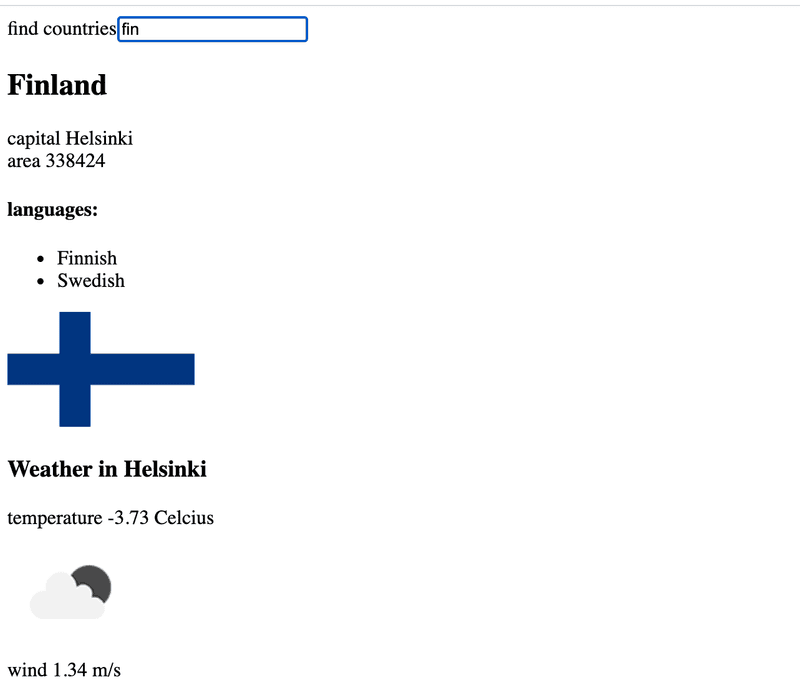

# 2.14 data for countries step3

## Task

Add to the view showing the data of a single country, the weather report for the capital of that country. There are dozens of providers for weather data. One suggested API is https://openweathermap.org. Note that it might take some minutes until a generated api key is valid.



## Solution

App.js:

```javascript

```