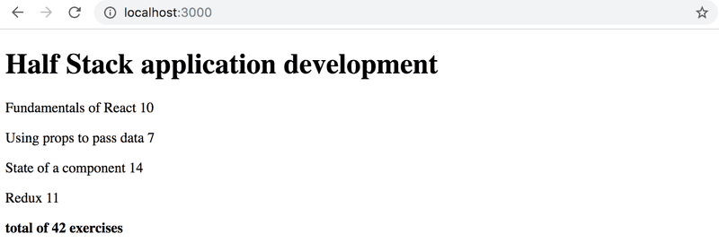

# 2.2: Course information step7

## Task

> Show also the sum of the exercises of the course. 



## Solution

Course.js:

```javascript
import Header from "./Header"
import Content from "./Content"
import Sum from "./Sum"

const Course = ({ course }) => {
  return (
    <div>
      <Header course={course} />
      <Content course={course} />
      <Sum course={course} />
    </div>
  )
}

export default Course
```

Sum.js:

```javascript
const Sum = ({ course }) => {
  const total = course.parts.reduce((sum, part) => sum + part.exercises, 0)
  
  return (
    <div>
      <h4>total of {total} exercises</h4>
    </div>
  )
}

export default Sum
```