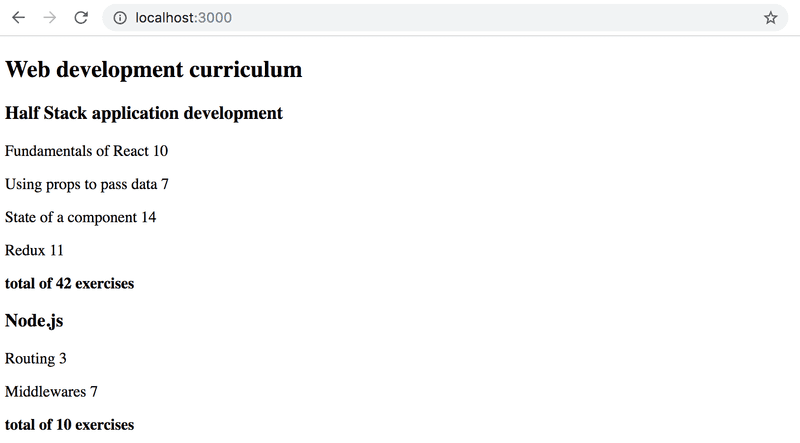

# 2.4: Course information step9

## Task

Let's extend our application to allow for an arbitrary number of courses:

```javascript
const App = () => {
  const courses = [
    {
      name: 'Half Stack application development',
      id: 1,
      parts: [
        {
          name: 'Fundamentals of React',
          exercises: 10,
          id: 1
        },
        {
          name: 'Using props to pass data',
          exercises: 7,
          id: 2
        },
        {
          name: 'State of a component',
          exercises: 14,
          id: 3
        },
        {
          name: 'Redux',
          exercises: 11,
          id: 4
        }
      ]
    }, 
    {
      name: 'Node.js',
      id: 2,
      parts: [
        {
          name: 'Routing',
          exercises: 3,
          id: 1
        },
        {
          name: 'Middlewares',
          exercises: 7,
          id: 2
        }
      ]
    }
  ]

  return (
    <div>
      // ...
    </div>
  )
}
```

The application can, for example, look like this: 



## Solution

App.js:

```javascript
import Course from "./components/Course"

const App = () => {
  const courses = [
    {
      name: 'Half Stack application development',
      id: 1,
      parts: [
        {
          name: 'Fundamentals of React',
          exercises: 10,
          id: 1
        },
        {
          name: 'Using props to pass data',
          exercises: 7,
          id: 2
        },
        {
          name: 'State of a component',
          exercises: 14,
          id: 3
        },
        {
          name: 'Redux',
          exercises: 11,
          id: 4
        }
      ]
    }, 
    {
      name: 'Node.js',
      id: 2,
      parts: [
        {
          name: 'Routing',
          exercises: 3,
          id: 1
        },
        {
          name: 'Middlewares',
          exercises: 7,
          id: 2
        }
      ]
    }
  ]

  return (
    <div>
      {courses.map(course => <Course key={course.id} course={course} />)}
    </div>
  )
}

export default App
```