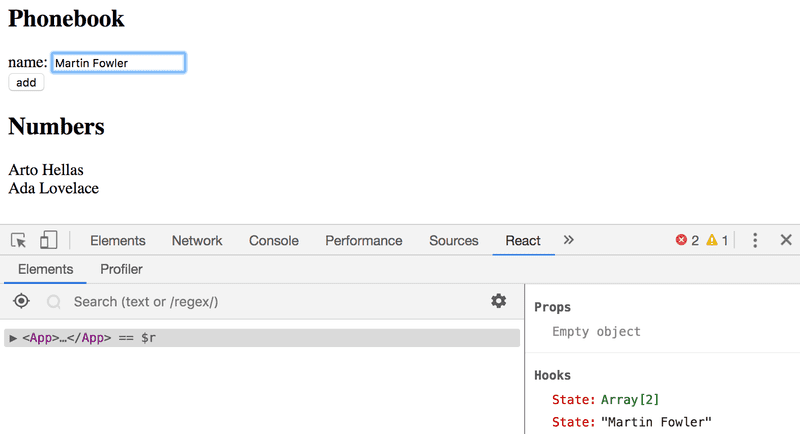

# 2.6: the phonebook step1

## Task

Let's create a simple phonebook. In this part we will only be adding names to the phonebook.

Let us start by implementing the addition of a person to phonebook.

You can use the code below as a starting point for the App component of your application:

```javascript
import { useState } from 'react'

const App = () => {
  const [persons, setPersons] = useState([
    { name: 'Arto Hellas' }
  ]) 
  const [newName, setNewName] = useState('')

  return (
    <div>
      <h2>Phonebook</h2>
      <form>
        <div>
          name: <input />
        </div>
        <div>
          <button type="submit">add</button>
        </div>
      </form>
      <h2>Numbers</h2>
      ...
    </div>
  )
}

export default App
```

After finishing this exercise your application should look something like this:



## Solution

```javascript
import { useState } from 'react'

const App = () => {
  const [persons, setPersons] = useState([{ name: 'Arto Hellas' }]) 
  const [newName, setNewName] = useState('')

  const addPerson = (event) => {
    event.preventDefault();
    const personObject = {name: newName}
    setPersons(persons.concat(personObject))
    setNewName("")
  }
  
  const handleNameChange = (event) => {
    setNewName(event.target.value)
  }

  return (
    <div>
      <h2>Phonebook</h2>
      <form onSubmit={addPerson}>
        <div>
          name: <input value={newName} onChange={handleNameChange}/>
        </div>
        <div>
          <button type="submit">add</button>
        </div>
      </form>
      <h2>Numbers</h2>
      <ul>
        {persons.map(person => <li key={person.name}>{person.name}</li>)}
      </ul>
    </div>
  )
}

export default App

```