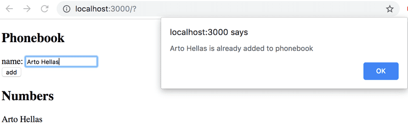

# 2.7: the phonebook step2

## Task

Prevent the user from being able to add names that already exist in the phonebook. JavaScript arrays have numerous suitable methods for accomplishing this task. Keep in mind how object equality works in Javascript.

Issue a warning with the alert command when such an action is attempted:



## Solution

App.js:

```javascript
import { useState } from 'react'

const App = () => {
  const [persons, setPersons] = useState([{ name: 'Arto Hellas' }]) 
  const [newName, setNewName] = useState('')

  const addPerson = (event) => {
    event.preventDefault();
    
    if (persons.filter(person => person.name === newName).length > 0) {
      alert(`${newName} is already added to the phonebook`)
    } else {
      const personObject = {name: newName}
      setPersons(persons.concat(personObject))
      setNewName("")
    }
  }
  
  const handleNameChange = (event) => {
    setNewName(event.target.value)
  }

  return (
    <div>
      <h2>Phonebook</h2>
      <form onSubmit={addPerson}>
        <div>
          name: <input value={newName} onChange={handleNameChange}/>
        </div>
        <div>
          <button type="submit">add</button>
        </div>
      </form>
      <h2>Numbers</h2>
      <ul>
        {persons.map(person => <li key={person.name}>{person.name}</li>)}
      </ul>
    </div>
  )
}

export default App
```