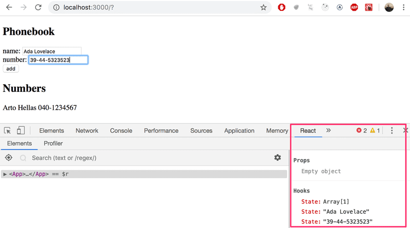

# 2.7: the phonebook step3

## Task

Expand your application by allowing users to add phone numbers to the phone book. You will need to add a second input element to the form (along with its own event handler):

```javascript
<form>
  <div>name: <input /></div>
  <div>number: <input /></div>
  <div><button type="submit">add</button></div>
</form>
```

At this point the application could look something like this. The image also displays the application's state with the help of React developer tools:



## Solution

App.js:

```javascript
import { useState } from 'react'

const App = () => {
  const [persons, setPersons] = useState([{ name: 'Arto Hellas', number: 123 }]) 
  const [newName, setNewName] = useState('')
  const [newNumber, setNewNumber] = useState("")

  const addPerson = (event) => {
    event.preventDefault();
    
    if (persons.filter(person => person.name === newName).length > 0) {
      alert(`${newName} is already added to the phonebook`)
    } else {
      const personObject = {name: newName, number: newNumber}
      setPersons(persons.concat(personObject))
      setNewName("")
      setNewNumber("")
    }
  }
  
  const handleNameChange = (event) => {
    setNewName(event.target.value)
  }

  const handleNumberChange = (event) => {
    setNewNumber(event.target.value)
  }

  return (
    <div>
      <h2>Phonebook</h2>
      <form onSubmit={addPerson}>
        <div>name: <input value={newName} onChange={handleNameChange} /></div>
        <div>number: <input value={newNumber} onChange={handleNumberChange} /></div>
        <div><button type="submit">add</button></div>
      </form>
      <h2>Numbers</h2>
      <ul>
        {persons.map(person => <li key={person.name}>{person.name} {person.number}</li>)}
      </ul>
    </div>
  )
}

export default App
```