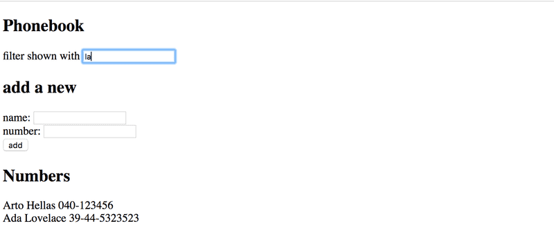

# 2.9: the phonebook step4

## Task

Implement a search field that can be used to filter the list of people by name:



## Solution

App.js:

```javascript
import { useState } from 'react'

const App = () => {
  const [persons, setPersons] = useState([
    { name: 'Arto Hellas', number: '040-123456', id: 1 },
    { name: 'Ada Lovelace', number: '39-44-5323523', id: 2 },
    { name: 'Dan Abramov', number: '12-43-234345', id: 3 },
    { name: 'Mary Poppendieck', number: '39-23-6423122', id: 4 }
  ]) 
  const [newName, setNewName] = useState("")
  const [newNumber, setNewNumber] = useState("")
  const [searchName, setSearchName] = useState("")
  const search = persons.filter(person => person.name.startsWith(searchName))

  const addPerson = (event) => {
    event.preventDefault();
    
    if (persons.filter(person => person.name === newName).length > 0) {
      alert(`${newName} is already added to the phonebook`)
    } else {
      const personObject = {name: newName, number: newNumber}
      setPersons(persons.concat(personObject))
      setNewName("")
      setNewNumber("")
    }
  }
  
  const handleNameChange = (event) => {
    setNewName(event.target.value)
  }

  const handleNumberChange = (event) => {
    setNewNumber(event.target.value)
  }

  const handleSearchChange = (event) => {
    setSearchName(event.target.value)
  }

  return (
    <div>
      <h2>Phonebook</h2>
      <div>filter shown with <input value={searchName} onChange={handleSearchChange} /></div>
      <h2>add a new</h2>
      <form onSubmit={addPerson}>
        <div>name: <input value={newName} onChange={handleNameChange} /></div>
        <div>number: <input value={newNumber} onChange={handleNumberChange} /></div>
        <div><button type="submit">add</button></div>
      </form>
      <h2>Numbers</h2>
      <ul>
        {search.map(person => <li key={person.name}>{person.name} {person.number}</li>)}
      </ul>
    </div>
  )
}

export default App
```